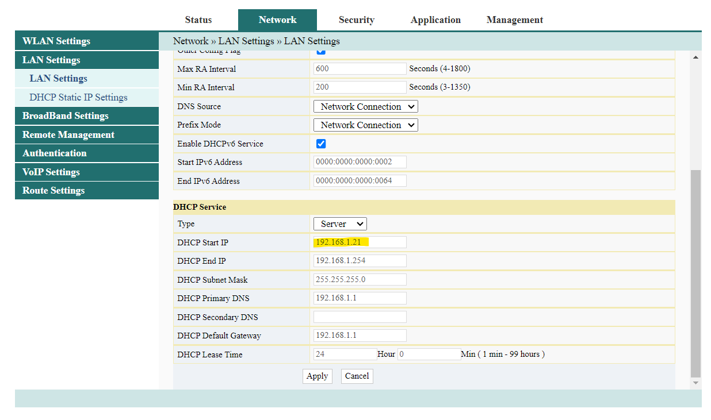
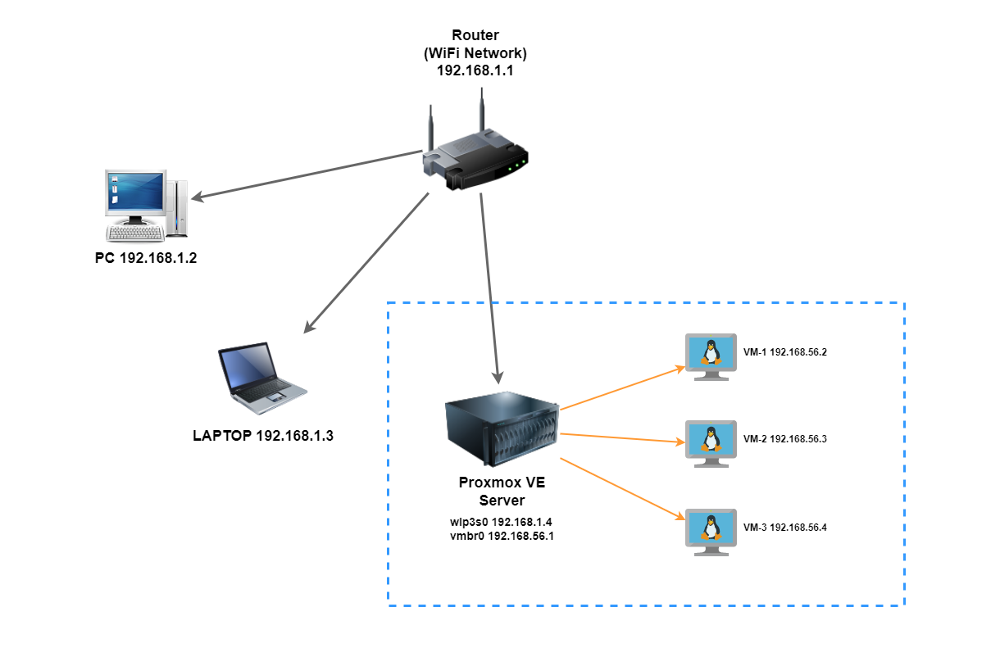
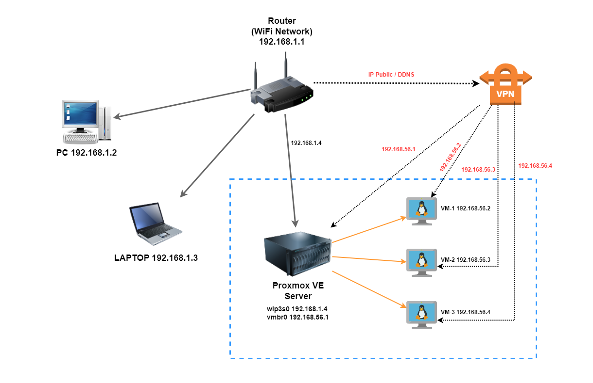
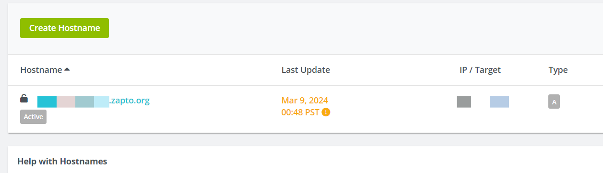
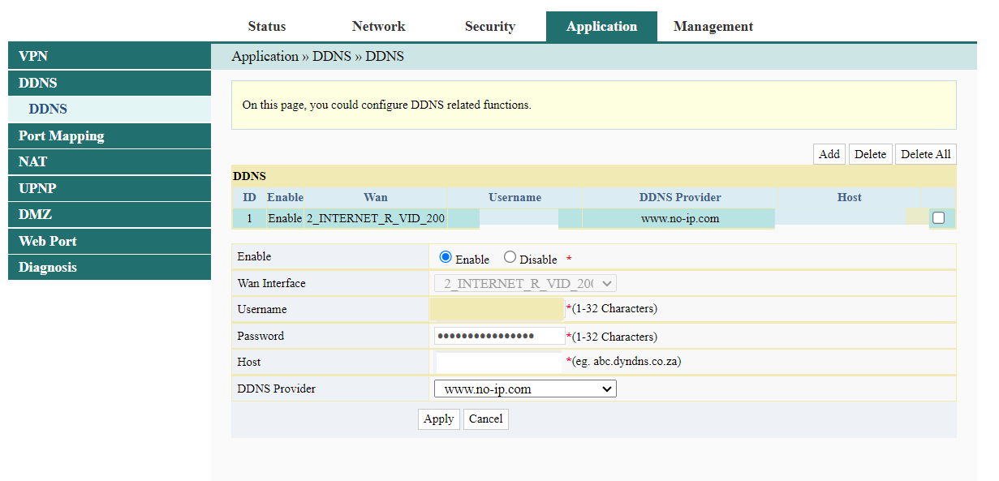
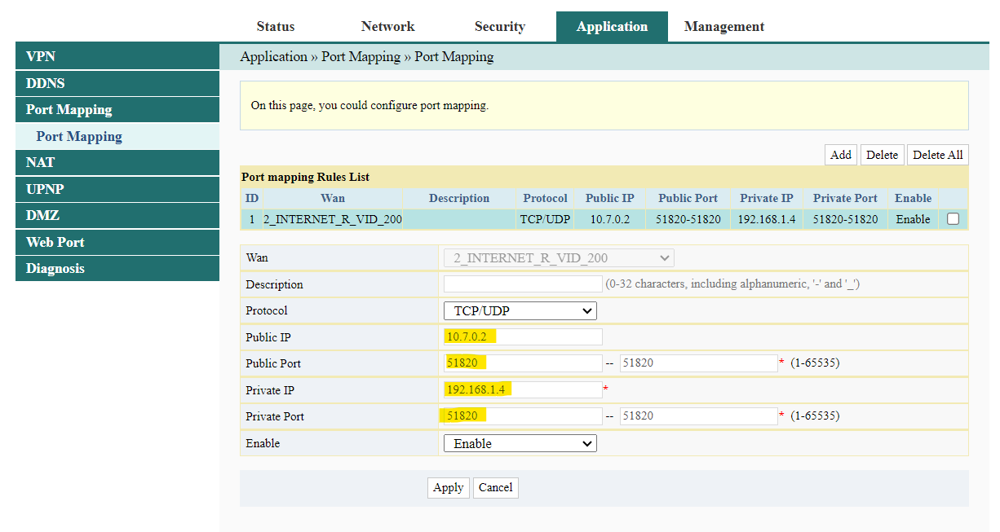

# Setup Homelab Server using Proxmox


This is my documentation on setting up a home lab server with the aim of learning how to provision a server for my learning needs.

## Configure Proxmox with Wifi Interface 

### Disable Enterprise Subscription Repository

Add `pve-no-subscription` repository on `/etc/apt/sources.list`
```bash
deb http://download.proxmox.com/debian/pve bookworm pve-no-subscription
```

Comment `ceph` enterprise repository on `/etc/apt/sources.list.d/ceph.list`
```bash
# deb https://enterprice.proxmox.com/debian/ceph-quincy bookworm enterprice
```

Comment `pve` enterprise repository on `/etc/apt/sources.list.d/pve-enterprice.list`
```bash
# deb https://enterprice.proxmox.com/debian/pve bookworm enterprice
```

Do update and upgrade apt
```bash
apt update && apt upgrade -y
```

### Wireless Interface Configuration



Go to your router and set static private IP for wifi network `go to Network -> LAN Settings`. In my case, I will set started DHCP from `192.168.1.21` so I can set static private IP in range from `192.168.1.2` to `192.168.1.20`. I planned to configure IP list like this:
- `192.168.1.2` PC
- `192.168.1.3` Laptop
- `192.168.1.4` Homeserver



Then remote your proxmox server and install `wireless-tools`
```bash
apt install -y wireless-tools
```

Do a backup of the network interface first
```bash
cp /etc/network/interfaces /etc/network/interfaces.bak
```

Configure network interface for wlan on `/etc/network/interfaces`
```conf
auto lo
iface lo inet loopback

iface enp0s31f6 inet manual

auto vmbr0
iface vmbr0 inet manual
    address 192.168.56.1/24
    bridge-ports none
    bridge-stp off
    bridge-fd 0
    
    post-up echo 1 > /proc/sys/net/ipv4/ip_forward
    post-up iptables -t nat -A POSTROUTING -s '192.168.56.0/24' -o wlp3s0 -j MASQUERADE
    post-down iptables -t nat -D POSTROUTING -s '192.168.56.0/24' -o wlp3s0 -j MASQUERADE
    
    post-up   iptables -t raw -I PREROUTING -i fwbr+ -j CT --zone 1
    post-down iptables -t raw -D PREROUTING -i fwbr+ -j CT --zone 1

auto wlp3s0
iface wlp3s0 inet static
    address 192.168.1.4
    netmask 255.255.255.0
    gateway 192.168.1.1
    wpa-ssid "<YOUR_SSID>"
    wpa-psk "<YOUR_PASSWORD>"

source /etc/network/interfaces.d/*
```

**Note**:
- `vmbr0` is VM bridge network interface, so this interface will be use for internal networking between proxmox server and VM. We can assume this interface as a **gateway** for VM
- It will be configure to enable ipv4 forwarding using `wlp3s0` interface to get access on the internet. Please see [**Proxmox Network Configuration**](https://pve.proxmox.com/wiki/Network_Configuration) for **masquerading (NAT)** with ip tables
- `enp0s31f6` is ethernet lan interface, adjust with actual interface
- `wlp3s0` is wlan interface, adjust with actual interface
- Set SSID and PSK security inside the network interface to automatically connect to the WiFi

Configure DNS server on `/etc/resolv.conf`
```conf
search localhost
nameserver 192.168.1.1
nameserver 8.8.8.8
nameserver 8.8.4.4
```

Finally, restart networking with this command `systemctl restart networking` and try to ping `google.com` to makesure our proxmox server have internet access using WiFi.

You can try to create new VM, I use [`Ubuntu Server 22.04.4 LTS`](https://ubuntu.com/download/server) iso. And configure network like this:
```bash
Subnet      : 192.168.56.0/24
IP Address  : 192.168.56.X
Gateway     : 192.168.56.1
DNS         : 192.168.56.1
```

Or if you still not have internet access, you can follow the `/etc/netplan/00-installer-config.yaml` below.
```yaml
# This is network config written by 'subiquity'
network:
  ethernets:
    ens18:
      addresses:
        - 192.168.56.X/24
      nameserver:
        addresses: 
          - 8.8.8.8
          - 8.8.4.4
          - 192.168.56.1
        search: []
      routes:
        - to: 0.0.0.0/0
        - via: 192.168.56.1
  version: 2
```

### VPN Configuration

Before use VPN we can't access VM directly from our PC / LAPTOP because it have different network. Our device using router network and our VM using `VMBridge` network.



I use VPN because I want using WiFi network instead of ethernet LAN cable. VM network is using `vmbr0` as their gateway, so it can't connect to VM directly from PC or LAPTOP outside internal network Proxmox VE. Thats why we need to using VPN to cover the network.

First step, we will register free DDNS (Dynamic Domain Name System). Because I don't have public IP so to handle that I use DDNS and using the [NoIP](https://www.noip.com/). Then create a hostname that will be use for VPN later. Makesure the IP/Target is current your IP public.



I recommend using `WireGuard` for VPN provider because it is simple installation. We need to install and configure WireGuard VPN on **Proxmox Host**. You can follow the instruction from this [documentation](https://github.com/Nyr/wireguard-install) or you can follow this step below. **Note:** On the client side (PC / LAPTOP) must install the `WireGuard` client.

Run this script and follow the assistant.
```bash
wget https://git.io/wireguard -O wireguard-install.sh && bash wireguard-install.sh
```

Select default gateway ipv4 address using wlan ip `192.168.1.4`
```bash
Which IPv4 address should be used?
     1) 192.168.1.4
     2) 192.168.56.1
IPv4 address [1]:
```

If see this prompt below, you can fill in using registered hostname.
```bash
This server is behind NAT. What is the public IPv4 address or hostname?
Public IPv4 address / hostname [XX.XX.XX.XX]:
```

And select DNS server for the client, I will use Google `8.8.8.8` or `8.8.4.4`.
```bash
Select a DNS server for the client:
   1) Current system resolvers
   2) Google
   3) 1.1.1.1
   4) OpenDNS
   5) Quad9
   6) AdGuard
DNS server [1]: 2
```

Then we will have generated `<client_name>.conf` configuration file. The file should be like this. Then copy into a new file on client side and import into `WireGuard` client. 

```conf
[Interface]
Address = 10.7.0.2/24
DNS = 8.8.8.8, 8.8.4.4
PrivateKey = secretprivatekey=

[Peer]
PublicKey = secretpublickey=
PresharedKey = secretpresharedkey=
AllowedIPs = 0.0.0.0/0, ::/0
Endpoint = yourddns.zapto.org:51820
PersistentKeepalive = 25
```

**Note: We will configure DDNS and port forwarding on our router first before connecting into VPN.**


Go to your router `Application -> DDNS` and configure DDNS like this. Fill the `username`, `password` and `hostname` according your `NoIP` account.



Then go to `Application -> Port Mapping` or it can be `Port Forwarding` and configure like this. Public IP is the `WireGuard` IP which is on config file, usually if default will be use `10.7.0.2` and default port `51820`. And will be route into our private IP at `192.168.1.4` with the same port.

Because I don't want allow any traffic outside my port forwarding configuration, I will set range only `51820 to 51820` that means only allow port `51820` from `10.7.0.2`.



Finally, we can connect into our VPN using `WireGuard` client. Once connected, we can access  our Proxmox server using `vmbr0` local VM IP at `192.168.56.1` or directly access our VM via VM bridge at `192.168.56.X`
```bash
ssh username@192.168.56.X
```

### References
- [Proxmox Network Configuration](https://pve.proxmox.com/wiki/Network_Configuration)
- [[WORKAROUND FOUND] Routing issues probably self-inflicted. Amateur needs help. Only for patient users.](https://forum.proxmox.com/threads/workaround-found-routing-issues-probably-self-inflicted-amateur-needs-help-only-for-patient-users.78669/)
- [Proxmox WIFI interface in bridge](https://forum.proxmox.com/threads/proxmox-wifi-interface-in-bridge.125624/)
- [Port forwarding from external to internal isolated LAN](https://forum.proxmox.com/threads/port-forwarding-from-external-to-internal-isolated-lan.138540/)
- [OpenVPN install on Proxmox LXC - VPN tutorial](https://www.youtube.com/watch?v=nsy9acOKnPo)
- [Easiest VPN on Proxmox with WireGuard](https://www.youtube.com/watch?v=V9sWhnYQvpE)
- [WireGuard Install](https://github.com/Nyr/wireguard-install)